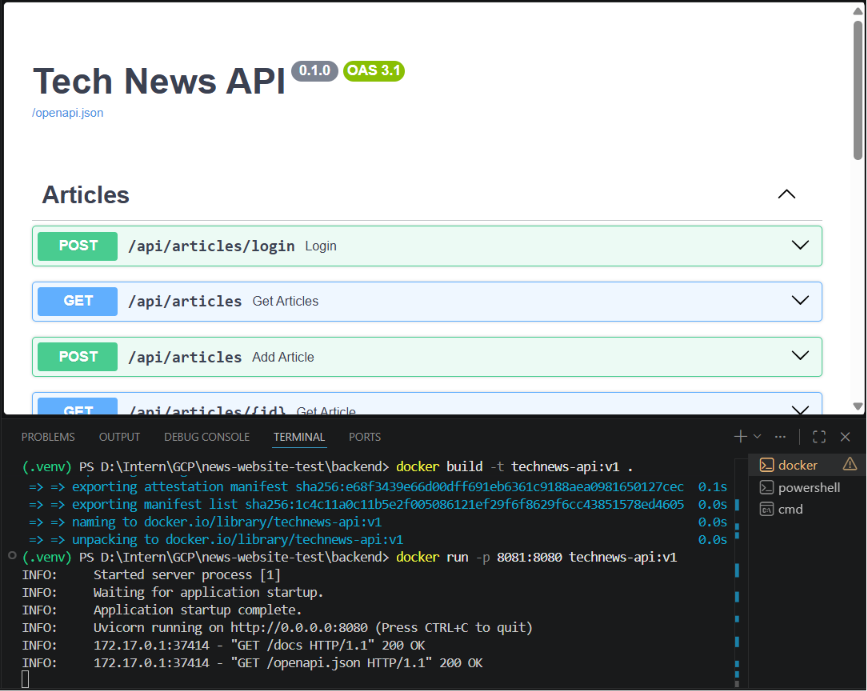
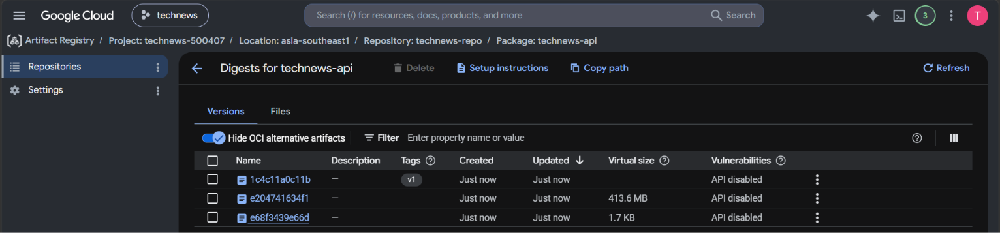

# Dự án Technews - Lộ trình Thực tập Cloud Engineer

## Day 1: GCP Setup & IAM Basics

### 1. Thông tin Google Cloud Project
* **Tên Project:** technews
* **Project ID:** technews-500407
* **Khu vực (Region) mặc định:** asia-southeast1 (Singapore)
* **Budget & Alerts:** Đã thiết lập ngân sách [$40/tháng] và cảnh báo ở mức 50%, 90%, 100%.

### 2. Các APIs đã kích hoạt (Enabled APIs)
Dự án đã bật các API cần thiết để phục vụ cho ứng dụng và CI/CD:
* Cloud Run API
* Artifact Registry API
* Compute Engine API

### 3. Thiết lập IAM & Service Account
Để chuẩn bị cho việc tự động hóa triển khai (deployment), đã tạo một Service Account với nguyên tắc cấp quyền:
* **Tên Service Account:** tech-news-deployer
* **Các quyền (Roles) được cấp:**
  * Cloud Run Admin
  * Artifact Registry Writer
  * Service Account User
* **Xác thực:** Đã tạo file JSON key (đã được lưu trữ bảo mật cục bộ, không commit lên git).

### 4. GCP CLI Setup
* Đã cài đặt thành công Google Cloud CLI trên máy cá nhân.
* Đã đăng nhập và xác thực thành công bằng lệnh `gcloud auth login`.

---

## Day 2: Docker Fundamentals

---

## 1. Kiến thức lý thuyết cốt lõi

### Docker Image (Khuôn đúc)
Là một gói tĩnh (Read-only), chứa toàn bộ mã nguồn, môi trường thực thi (Python 3.13), các thư viện phụ thuộc và cấu hình hệ thống cần thiết để ứng dụng **TechNews API** có thể chạy.

### Docker Container (Thực thể sống)
Là một tiến trình cô lập được khởi tạo từ Docker Image. Container sử dụng tài nguyên thật của hệ thống và có vòng đời riêng.

### Docker Layers (Cấu trúc xếp lớp)
Mỗi chỉ thị trong `Dockerfile` sẽ tạo ra một **layer** riêng biệt. Docker sử dụng các layer này để tối ưu việc lưu trữ và tái sử dụng dữ liệu.

### Docker Cache (Bộ nhớ đệm)
Docker tự động lưu lại các layer đã build. Khi build lại Image, nếu một layer không thay đổi thì Docker sẽ sử dụng cache thay vì thực hiện lại toàn bộ bước đó, giúp giảm đáng kể thời gian build.

---

## 2. Cấu trúc `Dockerfile` và `.dockerignore`

Dockerfile được thiết kế nhằm tối ưu hiệu năng build, tận dụng Docker Cache và tăng cường bảo mật bằng cách sử dụng **Non-root User**.

### Dockerfile

```dockerfile
FROM python:3.13

WORKDIR /usr/local/app

# Cài đặt dependencies trước để tận dụng Docker Cache
COPY requirements.txt ./
RUN pip install --no-cache-dir -r requirements.txt

# Sao chép toàn bộ mã nguồn
COPY . .

EXPOSE 8080

# Tăng cường bảo mật bằng Non-root User
RUN useradd app
USER app

# Khởi chạy API
CMD ["uvicorn", "main:app", "--host", "0.0.0.0", "--port", "8080"]
```

### `.dockerignore`

```text
.git
.gitignore
venv/
.venv/
__pycache__/
*.pyc
.env
dockerfile
.dockerignore
```

---

## 3. Hướng dẫn chạy ứng dụng

### Bước 1: Build Docker Image

```bash
docker build -t technews-api:v1 .
```

### Bước 2: Chạy Docker Container

```bash
docker run -p 8080:8080 technews-api:v1
```

Sau khi container khởi chạy thành công, API sẽ có thể truy cập tại:

```text
http://localhost:8080
```

---

## 4. Kết quả

- Xây dựng Docker Image thành công.
- Khởi chạy thành công Docker Container.
- Ứng dụng TechNews API hoạt động bình thường trong môi trường Docker cục bộ.
- API có thể truy cập tại:

```text
http://localhost:8080
```


---

## Day 3: Advanced Docker & Artifact Registry

---

# 1. Tối ưu hóa Docker Image bằng Multi-stage Build

Tiến hành nâng cấp `Dockerfile` sang kiến trúc **Multi-stage Build** nhằm tối ưu dung lượng Image và tăng tính bảo mật.

## Stage 1 - Builder

- Sử dụng môi trường ảo Python (`venv`) để cô lập các thư viện phụ thuộc.
- Cài đặt toàn bộ dependencies cần thiết cho quá trình build.
- Chuẩn bị các thành phần (artifacts) phục vụ cho Runtime Stage.

## Stage 2 - Runtime

- Sử dụng image `python:3.13-slim` nhằm giảm kích thước Docker Image.
- Chỉ sao chép các thành phần cần thiết từ Builder sang Runtime.
- Loại bỏ compiler, cache và các file tạm không cần thiết.

> **Kết quả:** Docker Image có kích thước nhỏ hơn, bảo mật hơn và thời gian triển khai nhanh hơn.

---

# 2. Thiết lập Google Artifact Registry

Đã tạo thành công Docker Repository trên Google Cloud.

| Thuộc tính | Giá trị |
|------------|----------|
| Repository Name | `technews-repo` |
| Repository Format | Docker |
| Region | `asia-southeast1` (Singapore) |

Khu vực lưu trữ được lựa chọn đồng bộ với hạ tầng mạng đã thiết lập từ **Day 1**, giúp giảm độ trễ khi triển khai.

---

# 3. Xác thực Docker với Google Cloud

Để Docker trên máy cục bộ có thể truy cập Artifact Registry, tiến hành cấu hình thông qua **Google Cloud CLI**.

## Cấu hình

```bash
gcloud auth configure-docker asia-southeast1-docker.pkg.dev
```

## Kết quả

Sau khi thực hiện lệnh, hệ thống hiển thị thông báo:

```text
gcloud credential helpers already registered correctly
```

Thông báo trên xác nhận Docker đã được cấu hình xác thực thành công với Google Cloud.

---

# 4. Chiến lược quản lý phiên bản Docker Image

Dự án áp dụng quy chuẩn đặt tên Image theo chuẩn của Google Artifact Registry.

## Quy ước đặt tên

```text
[REGION]-docker.pkg.dev/technews-500407/[REPOSITORY]/[IMAGE_NAME]:[TAG]
```

### Ví dụ

```text
asia-southeast1-docker.pkg.dev/my-project/technews-repo/technews-api:v1
```

## Chiến lược phát hành

- `v1`
- `v2`
- `v3`
- ...

Mỗi phiên bản phát hành đều được gắn tag riêng nhằm:

- Quản lý lịch sử phiên bản.
- Dễ dàng rollback khi cần.
- Hỗ trợ triển khai CI/CD.

## Gắn tag Image

```bash
docker tag technews-api:v1 \
asia-southeast1-docker.pkg.dev/technews-500407/technews-repo/technews-api:v1
```

---

# 5. Đẩy Docker Image lên Artifact Registry

Sau khi gắn tag, tiến hành đẩy Docker Image lên Google Cloud.

## Push Image

```bash
docker push asia-southeast1-docker.pkg.dev/technews-500407/technews-repo/technews-api:v1
```

## Kết quả

Docker Image được upload thành công lên Artifact Registry.

Artifact Registry hiển thị đầy đủ các thông tin:

- Repository
- Image Name
- Tag
- Digest
- Dung lượng Image
- Thời gian upload

Image đã sẵn sàng để sử dụng trong các bước triển khai Cloud tiếp theo.

---

# ✅ Kết quả đạt được

- Hoàn thành tối ưu Docker Image bằng **Multi-stage Build**.
- Thiết lập thành công **Google Artifact Registry**.
- Docker được xác thực với Google Cloud.
- Áp dụng chiến lược quản lý phiên bản Docker Image.
- Push thành công Docker Image lên Artifact Registry.
- Sẵn sàng phục vụ cho các bước triển khai **Kubernetes** và **CI/CD** ở các giai đoạn tiếp theo.

